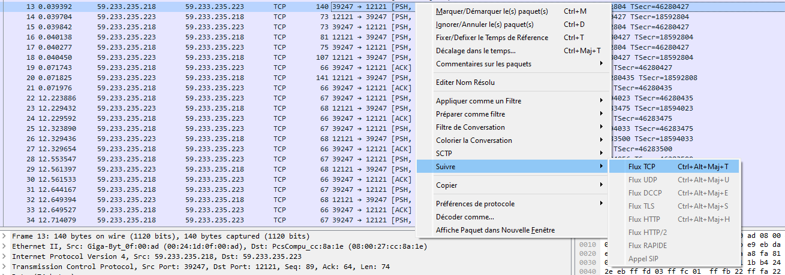

## Level 02


## Solution

This time we have a .pcap file

```
level02@SnowCrash:~$ ls
level02.pcap
```

.pcap files are files that contain information about a network, to see traffic or packets.

So the clue is obvious, we must open this file with a software that can read it, like Wireshark.


## Solution

So we open the file with Wireshark and we have this :


We have a lot of traffic, we see that the procotol is TCP, lets follow all the traffic to see if we can extract a message from it :




And now everything become clear :


If we take logic, the password would be "ft_wandr...NDRel.L0L"

But it doesn't work, what's the problem ?


Actually, wireshark replace non-printable character by a dot (.)

And how do we read non-printable character's value ? By looking their hexadecimal value.


So we now see that all of the dots have the hexadecimal value 7f, which is 127 in decimal, which is the DEL character in the ASCII Table.

Which give us the following password

"ft_waNDReL0L"

```
level02@SnowCrash:~$ su flag02
Password:
Don't forget to launch getflag !
flag02@SnowCrash:~$
```